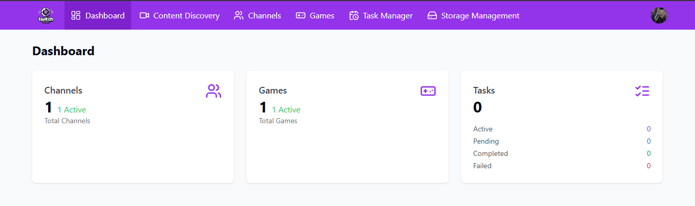
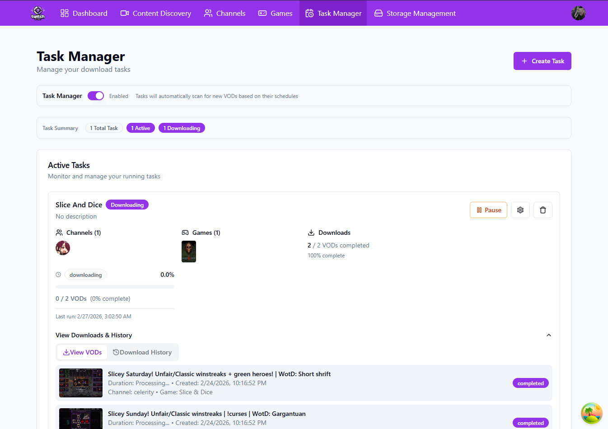
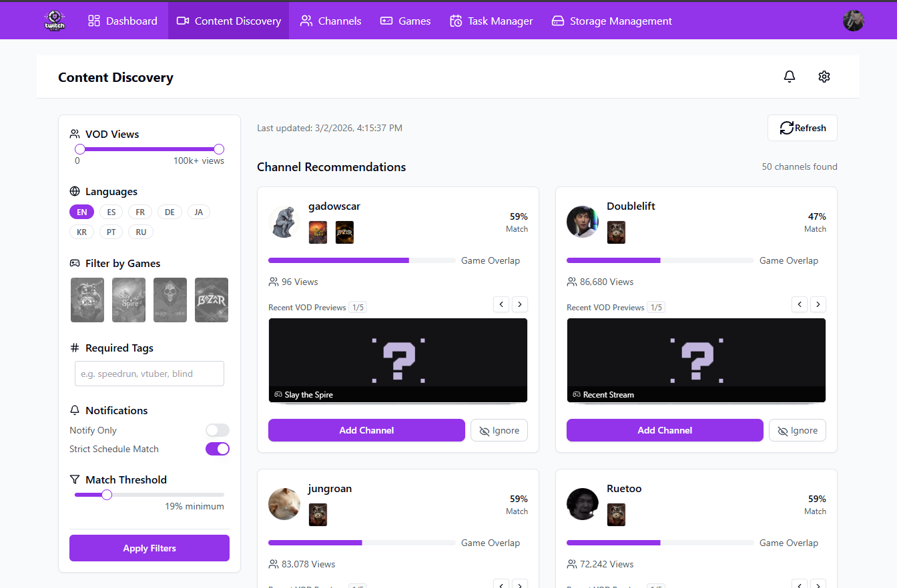
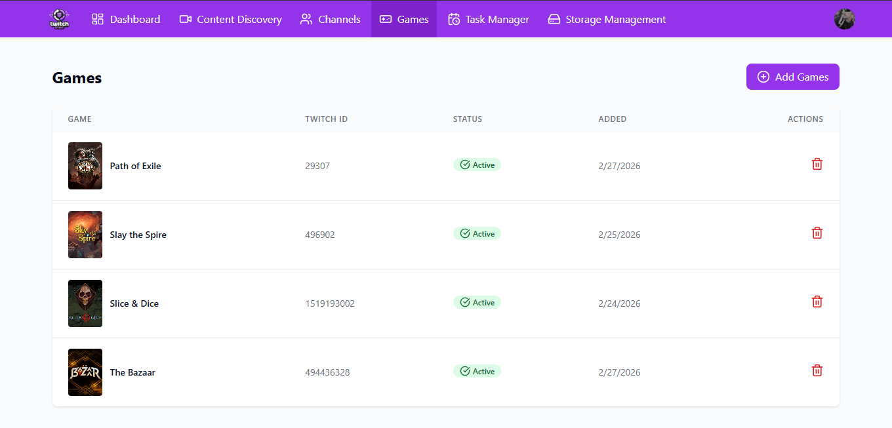
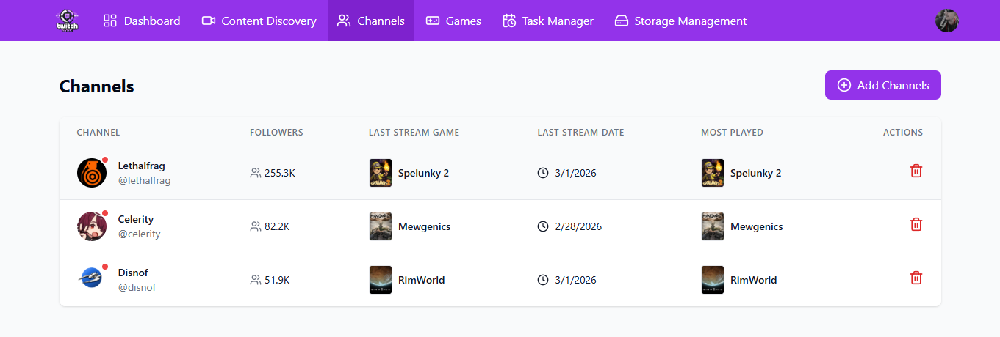

# TwitchSync

**TwitchSync** is a self-hosted Twitch VOD downloader and stream archiver built for your homelab. Define tasks once and let TwitchSync automatically monitor channels and game categories — downloading VODs the moment streams end, no manual intervention required.

> A modern, server-side alternative to Twitch Leecher. Runs 24/7 in Docker and saves VODs to local storage — point your media server at the output folder and your archive is ready to browse.

---

## 📸 Screenshots

### Dashboard

The main dashboard gives you an at-a-glance view of everything TwitchSync is doing. See active download tasks, which games are being watched, current download progress, and storage stats — all in one place.



---

### Task Manager

The Task Manager is where you build your automation rules. Each task defines **which channels or games** to monitor, with fine-grained filters to control exactly what gets downloaded — by game, keyword, stream title, duration, or quality.



**What you can configure per task:**
- 🎮 **Game filters** — only download VODs where the streamer was playing specific games
- 📺 **Channel targets** — watch specific Twitch channels
- 🔍 **Keyword rules** — include or exclude VODs by stream title keywords
- ⚙️ **Quality & duration** — set minimum stream length and preferred video quality

---

### Content Discovery

Content Discovery helps you find **new streamers to follow** based on what you're already watching. It analyzes the games and channels in your list and surfaces recommendations — so your archive grows with creators you'll actually care about.



**How it works:**
- Pulls recommendations based on your tracked games and channels
- Shows viewer counts, stream frequency, and content overlap
- One-click add to your channel or game watchlist

---

### Games

The Games page is your master list of Twitch game categories TwitchSync monitors. Add any game from the Twitch catalog and it will be used to filter downloads across all relevant tasks.



- Search and add games directly from the Twitch game catalog
- Each game entry ties into your Task Manager filters
- Remove games you're no longer interested in tracking

---

### Channels

The Channels page manages the specific Twitch streamers TwitchSync tracks. Add a channel and TwitchSync will watch for new VODs, respecting the game and keyword filters you've defined in your tasks.



- Add channels by Twitch username
- See live status and last-seen activity
- Each channel is persistent — TwitchSync re-checks automatically on a schedule

---

## 🚀 Deployment with Docker

### Prerequisites

- Docker and Docker Compose
- Twitch Developer Application credentials from the [Twitch Dev Console](https://dev.twitch.tv/console)

### Quick Start

1. **Clone the repo:**
   ```bash
   git clone https://github.com/Vermino/TwitchSync.git
   cd TwitchSync
   ```

2. **Configure environment variables:**
   ```env
   DB_USER=your_db_user
   DB_PASSWORD=your_db_password
   TWITCH_CLIENT_ID=your_twitch_client_id
   TWITCH_CLIENT_SECRET=your_twitch_client_secret
   ```

3. **Start the services:**
   ```bash
   docker-compose up -d
   ```

4. **Access the app:**
   - **Web UI:** `http://localhost:3000`
   - **API:** `http://localhost:3501`

---

## 🛠 Technical Stack

| Layer | Technology |
|---|---|
| **Backend** | Node.js, Express, PostgreSQL |
| **Frontend** | React (TypeScript), Tailwind CSS, Vite |
| **Scheduling** | Node-cron for automated task execution |
| **API** | Twitch Helix API via Axios |
| **Auth** | Twitch OAuth 2.0 + JWT |

---

## ⚖️ License

Licensed under the **GNU Affero General Public License v3.0 (AGPL-3.0)**. This ensures TwitchSync remains open source even when hosted as a service. See the [LICENSE](LICENSE) file for full details.
