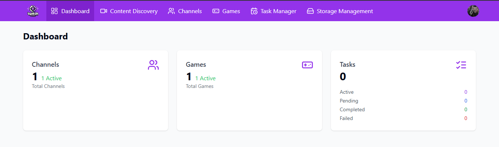
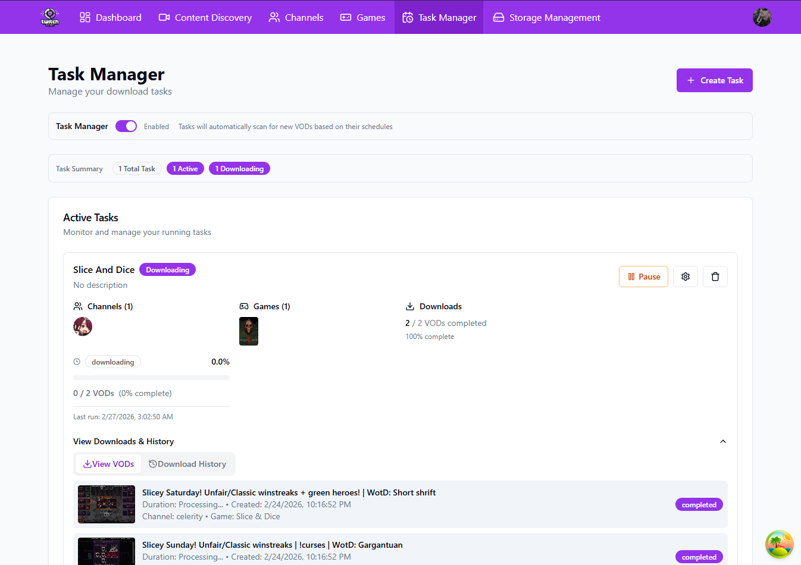
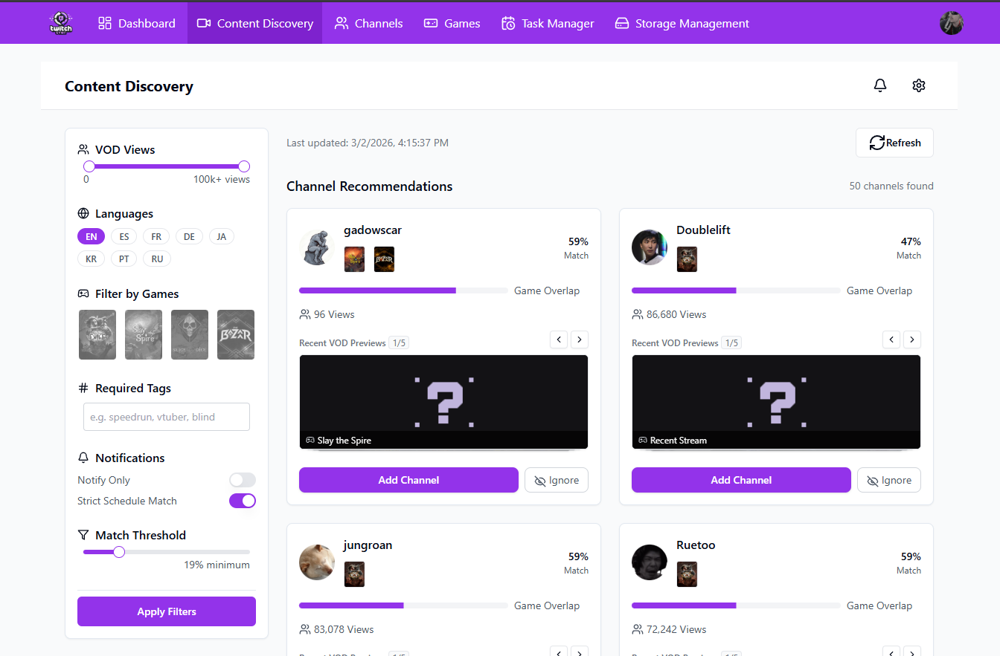
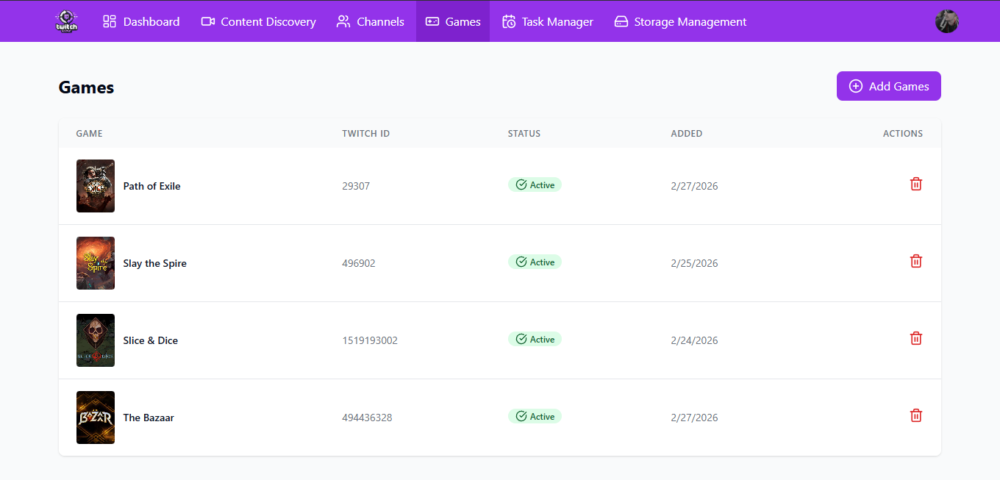
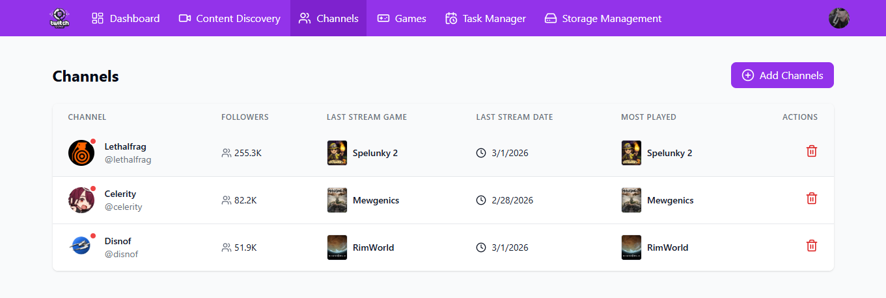

# Twitch Sync

Twitch Sync is a self-hosted Twitch VOD downloader and archive manager. It monitors Twitch channels, applies task rules such as game and title filters, downloads matching VODs, and stores them where your media server can index them.

The app is built for Docker-based home servers, but it avoids homelab-specific assumptions. Use a local IP, a private LAN hostname, or a public HTTPS domain as long as the Twitch OAuth redirect URL matches the address your browser uses.

## Features

- Twitch OAuth login
- Channel and game management
- Scheduled VOD discovery tasks
- Channel, game, title, language, duration, and view-count filters
- Download queue with progress tracking
- Resume/retry support for interrupted downloads
- Configurable VOD storage path
- React dashboard with real-time status updates
- Docker Compose deployment with PostgreSQL
- Reverse-proxy friendly frontend on port `2261`

## Screenshots

### Dashboard



### Task Manager



### Content Discovery



### Games



### Channels



## Requirements

- Docker and Docker Compose
- A Twitch Developer Application
- A host path or Docker volume for VOD storage

For public HTTPS access, put Twitch Sync behind a reverse proxy such as Caddy, nginx, Traefik, or Nginx Proxy Manager.

## Quick Start

```bash
git clone https://forge.404oak.com/Vermino/TwitchSync.git
cd TwitchSync

cp .env.example .env
# Edit .env and fill in PUBLIC_URL, Twitch credentials, JWT_SECRET, and storage settings.

docker compose up -d --build
```

Open the app at:

```text
http://YOUR_SERVER_IP:2261
```

If you are using a domain, set `PUBLIC_URL` to the external HTTPS URL instead:

```env
PUBLIC_URL=https://twitchsync.example.com
TWITCH_REDIRECT_URI=https://twitchsync.example.com/auth/twitch/callback
```

## Twitch App Setup

Create an app in the Twitch Developer Console:

1. Go to `https://dev.twitch.tv/console/apps`.
2. Create or register an application.
3. Set the client type to `Confidential`.
4. Add the OAuth redirect URL.
5. Copy the Client ID and generate a Client Secret.

The redirect URL must exactly match the public URL used by your browser:

```text
PUBLIC_URL + /auth/twitch/callback
```

Examples:

| Access method | `PUBLIC_URL` | Twitch redirect URL |
| --- | --- | --- |
| Local test | `http://localhost:2261` | `http://localhost:2261/auth/twitch/callback` |
| LAN server | `http://192.168.1.100:2261` | `http://192.168.1.100:2261/auth/twitch/callback` |
| HTTPS domain | `https://twitchsync.example.com` | `https://twitchsync.example.com/auth/twitch/callback` |

Do not use `localhost` in the Twitch console if your browser reaches the app through a server IP or domain.

## Environment

Start from `.env.example`:

```bash
cp .env.example .env
```

Important settings:

| Variable | Purpose |
| --- | --- |
| `PUBLIC_URL` | Browser-facing app URL. This is the source of truth for OAuth and CORS. |
| `TWITCH_CLIENT_ID` | Twitch application client ID. |
| `TWITCH_CLIENT_SECRET` | Twitch application secret. Keep this server-side only. |
| `TWITCH_REDIRECT_URI` | Must be `PUBLIC_URL` plus `/auth/twitch/callback`. |
| `JWT_SECRET` | Random secret for app sessions. Use at least 32 random bytes. |
| `DB_PASSWORD` | PostgreSQL password used by Docker Compose. |
| `VOD_STORAGE_HOST_PATH` | Optional host folder to mount as VOD storage. |
| `STORAGE_PATH` | Container path where downloads are written. Defaults to `/data/vods`. |

Generate strong values with:

```bash
openssl rand -hex 32
```

## Storage and Media Servers

By default, VODs are written inside the container at:

```text
/data/vods
```

To store files on a host path, set:

```env
VOD_STORAGE_HOST_PATH=/mnt/media/TwitchSync
STORAGE_PATH=/data/vods
```

Then point Jellyfin, Plex, Emby, or another media server at the same host folder.

## Reverse Proxy

Proxy public traffic to the frontend service:

```text
http://YOUR_SERVER_IP:2261
```

Required proxy behavior:

- Preserve `Host`
- Set `X-Forwarded-For`
- Set `X-Forwarded-Proto`
- Enable WebSocket upgrade headers

For Nginx Proxy Manager:

| Field | Value |
| --- | --- |
| Scheme | `http` |
| Forward Hostname/IP | your server IP |
| Forward Port | `2261` |
| Websockets Support | enabled |

When switching from IP access to a domain, update both `.env` and the Twitch console redirect URL.

## Development

Backend:

```bash
cd backend
npm install
npm run dev
```

Frontend:

```bash
cd frontend
npm install
npm run dev
```

Production build checks:

```bash
cd backend && npm run build
cd ../frontend && npm run build
```

## Security Notes

- Do not commit `.env` files.
- Treat `TWITCH_CLIENT_SECRET`, `JWT_SECRET`, database passwords, and OAuth tokens as secrets.
- The Twitch Client ID may appear in browser configuration; the Client Secret must not.
- If a real secret is ever committed, rotate it immediately and remove it from public history before publishing.

## License

Twitch Sync is licensed under the GNU Affero General Public License v3.0. See [LICENSE](LICENSE).
